### Hi there 👋

- 🔭 I’m currently a PhD Student in [Automatic Control](https://en.wikipedia.org/wiki/Automation) at [CentraleSupélec](https://www.centralesupelec.fr/)
- 📫 You can reach me at raccacio@poli.ufrj.br or [twitter](https://twitter.com/oaccacio).
- [My 2nd 🧠](https://github.com/Accacio/hippokamp)

<!--
**Accacio/Accacio** is a ✨ _special_ ✨ repository because its `README.md` (this file) appears on your GitHub profile.

Here are some ideas to get you started:

- 🌱 I’m currently learning ...
- 👯 I’m looking to collaborate on ...
- 🤔 I’m looking for help with ...
- 💬 Ask me about ...
- 📫 How to reach me: ...
- 😄 Pronouns: ...
- ⚡ Fun fact: ...
-->

Here you will find things related to music 🎶, games 🕹️ and engineering ⚙️ (mostly control).
#### Control Engineering
> Control Engineering is the art of taking what you have and transforming it in what you want.

This is an example of a simulation whose objective is to control the inverted pendulum in a upright position:

|  |  |  |
|:--:| :--: |:--: |
| *No control* | *Swing-Up without Stabilization* |  *Swing-Up with Stabilization* |

You can see the source code of this simulation [here](https://github.com/Accacio/pendulum)
